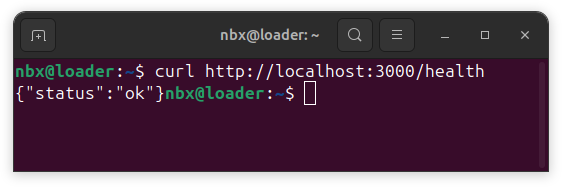

[](https://github.com/92username/desafio-devsecops-lacrei-saude/actions/workflows/ci.yml)  [](https://github.com/92username/desafio-devsecops-lacrei-saude/actions/workflows/owasp_zap.yml)  [](https://github.com/92username/desafio-devsecops-lacrei-saude/actions/workflows/deploy.yml)
# Health Check API

A simple Node.js API that provides a health check endpoint.

## Prerequisites

- Node.js 14 or higher
- npm (Node Package Manager)
- Docker (optional)

## Installation

1. Clone the repository:
```bash
git clone https://github.com/92username/desafio-devsecops-lacrei-saude
cd desafio-devsecops-lacrei-saude
```

2. Install dependencies:
```bash
npm install
```

## Running Locally
### Using Node.js directly:
```bash
npm start
```

or

```bash
node app.js
```

## Using Docker:

1. Build the image:
```bash
docker build -t health-api .
```

2. Run the container:
```bash
docker run -p 3000:3000 health-api
```
The api will be available at http://localhost:3000

## API Endpoints

### Health Check

- URL: '/health'
- Method: 'GET'
- Response: '{"status": "ok"}'

### Testing the API


Using curl:
```bash
curl http://localhost:3000/health
```
Expected response:
```bash
{"status": "ok"}
```
